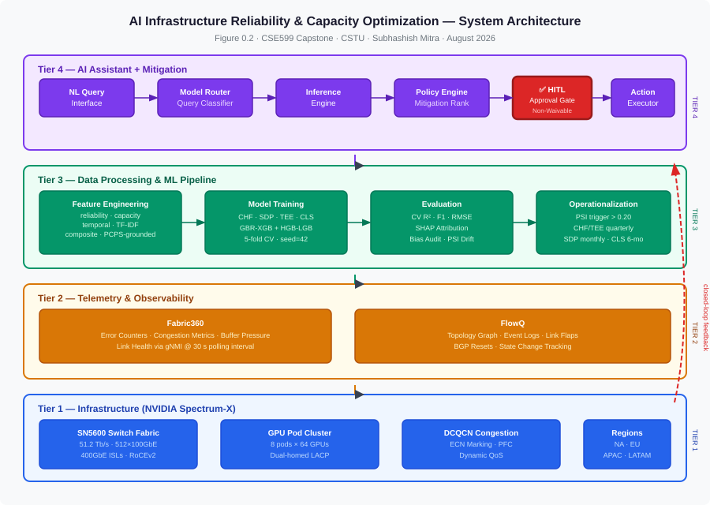
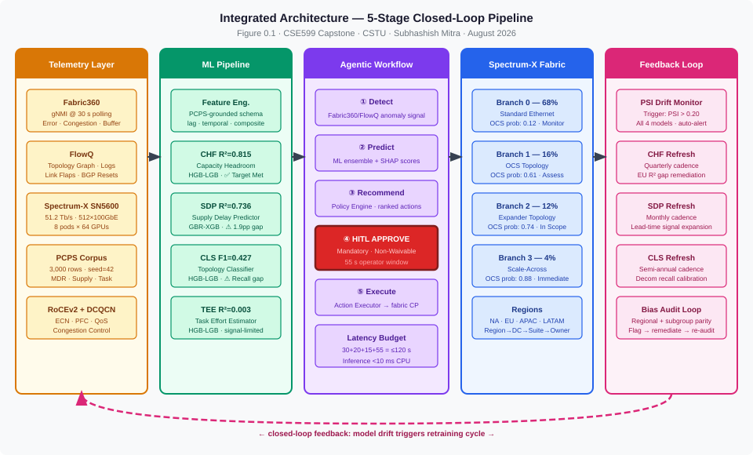
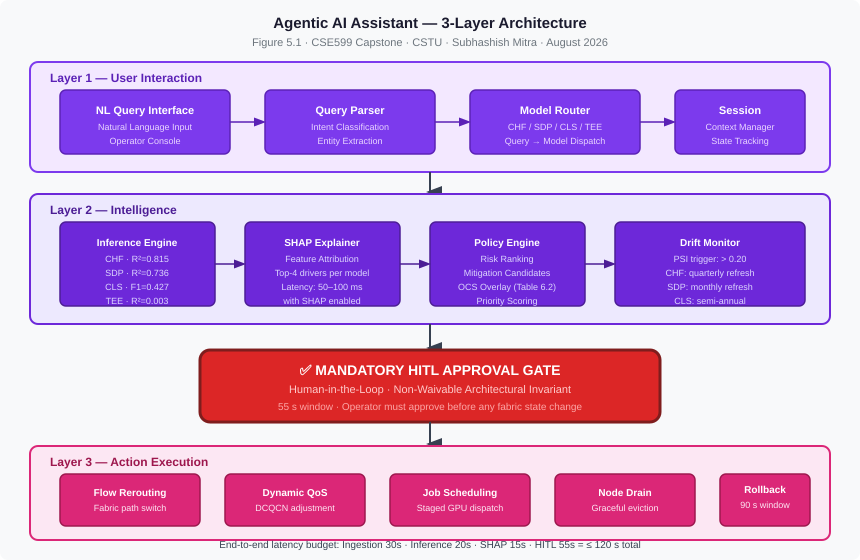

# AI Infrastructure Reliability & Capacity Optimization

**Emerging Technologies Program**  
**California Science and Technology University (CSTU)** · Milpitas, CA 95035  
**Subhashish Mitra** · August 2026  
**Course:** CSE599 – Computer Systems and Engineering Capstone

[](https://www.python.org/)
[](https://scikit-learn.org/)
[](https://cstu.edu)
[](LICENSE)

---

## Executive Summary

This project delivers an end-to-end **AI Infrastructure Reliability & Capacity Optimization** platform for hyperscale GPU data centers running **NVIDIA Spectrum-X Advanced Ethernet** fabric. The platform addresses four tightly coupled operational problems — capacity headroom forecasting, supply delay prediction, topology upgrade risk classification, and task effort estimation — within a unified Spectrum-X environment instrumented by **Fabric360** and **FlowQ** telemetry.

The platform spans a four-tier architecture: raw telemetry ingestion → ML feature engineering + model inference → agentic mitigation workflow → closed-loop fabric feedback. A natural-language AI Assistant routes operator queries through a policy-aware inference engine to automated action executors, completing the reliability loop through a mandatory **Human-in-the-Loop (HITL)** approval gate before any network-state change is executed.

📄 **[Full Project Report (PDF)](https://github.com/G-Hubby/ai-infra-reliability-capacity-optimization/blob/main/CSE599%20-%20AI%20Infrastructure%20Reliability%20%26%20Capacity%20Optimization.pdf)**

---

## Business Problem

Modern AI training clusters — operating 8 GPU pods × 64 GPUs on full-mesh 400 GbE ISLs — face compounding operational risks that static dashboards cannot address:

| Risk Domain | Observable Symptom | Operational Impact |
|---|---|---|
| **Capacity Exhaustion** | Headroom < 10 MW with no advance warning | Emergency de-racks, SLA breach |
| **Supply Chain Delay** | GPU/NIC lead times unpredictable by 60–120 days | Cluster expansion blocked |
| **Topology Obsolescence** | Gen-3 → Gen-4 switch upgrade window missed | Fabric bottleneck, throughput degradation |
| **Task Scheduling Blind Spots** | Task effort variance ±3 weeks | Ops overload, missed delivery commitments |

The **Production Capacity Planning System (PCPS)** — a real hyperscale data center planning schema — provides the reference hierarchy and schema that grounds all ML features and labels throughout this project.

---

## System Architecture



| Tier | Layer | Key Components |
|---|---|---|
| **Tier 1** | Infrastructure | Spectrum-X SN5600 (51.2 Tb/s, 512×100GbE); 8 GPU pods × 64 GPUs; dual-homed LACP; RoCEv2 + DCQCN; full-mesh 400GbE ISLs |
| **Tier 2** | Telemetry & Observability | **Fabric360** (error counters, congestion metrics, buffer pressure, link health via gNMI @ 30 s); **FlowQ** (topology graph, event logs, link flaps, BGP resets) |
| **Tier 3** | Data Processing & ML | PCPS-grounded feature engineering → 4 ML models (CHF · SDP · CLS · TEE) → SHAP attribution + bias audit |
| **Tier 4** | AI Assistant + Mitigation | NL Query Interface → Model Router → Inference Engine → Policy Engine → **✅ HITL Gate** → Action Executor |

### Infrastructure Hierarchy

```
Region  (NA · EU · APAC · LATAM)
  └── Datacenter  (~6 per region)
        └── Suite  (4–6 per datacenter)
              └── Service Owner
```

---

## Integrated Architecture



The five-stage pipeline — **Telemetry → ML Pipeline → Agentic Workflow → Spectrum-X Fabric → Feedback Loop** — operates as a closed-loop system. Model drift is monitored via Population Stability Index (PSI trigger: PSI > 0.20); models refresh on a cadence calibrated to operational risk (CHF quarterly, SDP monthly, CLS semi-annual, TEE quarterly).

---

## ML Approach

### Algorithm Mapping & Results

Two algorithm variants competed per model: **GBR-XGB** (sklearn `GradientBoosting*` — XGBoost-equivalent) and **HGB-LGB** (sklearn `HistGradientBoosting*` — LightGBM-equivalent). All models use 5-fold cross-validation, `random_state=42`.

| Model | Abbrev. | Task | Winner | CV Metric | Result | Target |
|---|---|---|---|---|---|---|
| Capacity Headroom Forecaster | CHF | Regression | HGB-LGB | CV R² | **0.815 ± 0.122** | ≥ 0.75 ✅ |
| Supply Delay Predictor | SDP | Regression | GBR-XGB | CV R² | **0.736 ± 0.049** | ≥ 0.75 ⚠️ 1.9 pp gap |
| Topology Upgrade Classifier | CLS | Classification | HGB-LGB | CV F1 | **0.427 ± 0.024** | Decom. Recall ≥ 0.70 ⚠️ |
| Task Effort Estimator | TEE | Regression | HGB-LGB | CV R² | **0.003 ± 0.055** | ≥ 0.25 ⚠️ signal-limited |

> **CHF** is the only model meeting its primary target. SDP, CLS, and TEE are documented with gap analysis and remediation paths (see Future Work).

### Top SHAP Features by Model

| Model | Rank 1 | Rank 2 | Rank 3 | Rank 4 |
|---|---|---|---|---|
| **CHF** | `lag1_headroom` *(AR-1 dominant)* | `supply_mw` | `lag1_util` | `region_enc` |
| **SDP** | `me_lroof_gap` | `total_gap` | `ms_me_gap` | `suite_status_enc` |
| **CLS** | `suite_status_enc` | `gen_num` | milestone gap features | — |
| **TEE** | `bk_pr` *(bucket × priority)* | `bucket_enc` | `priority_enc` | — |

### Bias Audit Results

| Model | Audit Dimension | Gap | Threshold | Status |
|---|---|---|---|---|
| SDP | Regional RMSE (4 regions) | 0.64 days | < 1.0 d | ✅ **PASS** |
| CHF | Regional R² (EU=0.566 vs APAC=0.905) | 0.389 R² units | — | 🚩 **FLAG** |
| TEE | Bucket RMSE gap | 1.43 wk | signal quality | 🚩 **FLAG** |
| CLS | Suite-status F1 (Decom F1=0.688 vs Retrofit F1=0.905) | 0.217 F1 | — | 🚩 **FLAG** |

---

## Synthetic Telemetry Pipeline

All models train on a **reproducible PCPS-grounded synthetic corpus** — no proprietary or production data is used or required.

| Corpus | Rows | Seed | ML Target |
|---|---|---|---|
| MDR (Master Deployment Record) | 1,200 | 42 | `supply_delay_days` (SDP) · `upgrade_label` (CLS) |
| Supply Plan | 800 | 42 | `headroom_mw` (CHF) |
| Task | 600 | 42 | `effort_weeks` (TEE) |

**Total: 3,000 rows** · Schema documented in Appendix A of the project report.

Source: [`src/pipeline/synthetic_telemetry_generator.py`](src/pipeline/synthetic_telemetry_generator.py)

---

## Agentic Workflow Architecture



The agentic layer implements a **5-step detect → predict → recommend → approve → execute cycle**:

| Step | Stage | Description |
|---|---|---|
| 1 | **Detect** | Fabric360 / FlowQ telemetry triggers anomaly signal |
| 2 | **Predict** | ML model ensemble generates risk scores + SHAP attribution |
| 3 | **Recommend** | Policy Engine generates ranked mitigation candidates |
| 4 | **Approve** | ✅ **HITL Gate** — mandatory human-in-the-loop approval *(non-waivable architectural invariant)* |
| 5 | **Execute** | Action Executor dispatches mitigation to Spectrum-X fabric control plane |

### End-to-End Latency Budget

| Stage | Allocation |
|---|---|
| Telemetry Ingestion | 30 s |
| ML Inference | 20 s |
| SHAP Attribution | 15 s |
| HITL Approval Window | 55 s |
| **Total End-to-End** | **≤ 120 s** |

**Single-row inference:** < 10 ms (CPU) · 50–100 ms (with SHAP)  
**Mitigation actions:** flow rerouting · dynamic QoS (DCQCN) · staged job scheduling · node draining · automated rollback *(90 s window)*

---

## Spectrum-X Cluster Topology

**Fabric:** NVIDIA Spectrum-X SN5600 · 51.2 Tb/s · 512 × 100 GbE ports · full-mesh 400 GbE ISLs · RoCEv2 + DCQCN congestion control

| Branch | Topology | Fleet Share | CLS Upgrade Probability | Recommended Action |
|---|---|---|---|---|
| Branch 0 | Standard Ethernet | 68% | 0.12 — Operational | Monitor |
| Branch 1 | OCS (Optical Circuit Switch) | 16% | 0.61 — Planned Upgrade | Schedule assessment |
| Branch 2 | Expander | 12% | 0.74 — Retrofit Scheduled | Include in scope |
| Branch 3 | Scale-Across | 4% | 0.88 — At Risk | **Immediate dual upgrade** |

> **Decommission Pending** suites: CLS probability = 0.03 — no upgrade action required.

---

## Repository Structure

```
ai-infra-reliability-capacity-optimization/
├── README.md
├── .gitignore
├── requirements.txt
├── report/
│   └── CSE599 - AI Infrastructure Reliability & Capacity Optimization.pdf
├── diagrams/
│   ├── system-architecture.svg        # Figure 0.2 — 4-tier system architecture
│   ├── ai-assistant-architecture.svg  # Figure 5.1 — 3-layer agentic workflow + HITL gate
│   └── integrated-architecture.svg    # Figure 0.1 — 5-stage integrated pipeline
├── src/
│   ├── pipeline/
│   │   └── synthetic_telemetry_generator.py   # PCPS-grounded corpus (3,000 rows, seed=42)
│   ├── training/
│   │   └── model_training.py                  # GBR-XGB + HGB-LGB dual-variant training
│   └── evaluation/
│       └── model_evaluation.py                # SHAP + bias audit + operationalization
├── data/                              # Generated data (git-ignored)
│   └── .gitkeep
└── models/                            # Saved model artifacts (git-ignored)
    └── .gitkeep
```

---

## Getting Started

### Prerequisites

```bash
pip install -r requirements.txt
```

### 1 · Generate Synthetic Corpus

```bash
python src/pipeline/synthetic_telemetry_generator.py
# → data/mdr_corpus.csv  (1,200 rows)
# → data/supply_corpus.csv  (800 rows)
# → data/task_corpus.csv  (600 rows)
```

### 2 · Train All Models

```bash
python src/training/model_training.py
# → models/chf_hgb.pkl · models/sdp_gbr.pkl · models/cls_hgb.pkl · models/tee_hgb.pkl
```

### 3 · Run Evaluation & Bias Audit

```bash
python src/evaluation/model_evaluation.py
# → SHAP feature attribution plots
# → Bias audit report (regional + subgroup)
# → Operationalization drift schedule
```

---

## For Recruiters

This project demonstrates production-grade engineering across five domains relevant to hyperscale AI infrastructure roles:

| Domain | Skills Demonstrated |
|---|---|
| **ML Engineering** | Dual-variant model training (GBR-XGB / HGB-LGB); 5-fold cross-validation; SHAP feature attribution; subgroup bias auditing; PSI drift monitoring |
| **Infrastructure Engineering** | NVIDIA Spectrum-X SN5600 fabric design; RoCEv2 + DCQCN congestion control; gNMI telemetry; GPU pod topology (8 pods × 64 GPUs) |
| **Data Engineering** | PCPS-grounded synthetic corpus (3,000 rows, seed=42); reproducible schema; multi-corpus feature engineering pipeline |
| **AI Systems Architecture** | 4-tier platform design; 5-step agentic workflow; mandatory HITL gate; ≤ 120 s end-to-end latency budget |
| **Responsible AI** | Structured bias audit framework; regional parity analysis; documented flag-and-remediation findings; drift-triggered model refresh |

**Author:** Subhashish Mitra · CSE599 Capstone · California Science and Technology University (CSTU) · Emerging Technologies Program · August 2026

---

## Future Work

### Near-Term (Next Quarter)

| Item | Rationale |
|---|---|
| TF-IDF enrichment for TEE | Task description text is the primary untapped signal — TF-IDF features are projected to lift CV R² from 0.003 toward ≥ 0.25 |
| CHF EU region calibration | Regional R² gap of 0.389 (EU=0.566 vs APAC=0.905) driven by EU conservative demand planning posture; Bayesian recalibration planned |
| CLS threshold calibration | Decommission class recall = 0.550 vs target ≥ 0.70; class-weight adjustment and probability threshold tuning required |
| SDP feature expansion | 1.9 pp gap to ≥ 0.75 target; vendor lead-time and order backlog signals are primary candidates |

### Long-Term

| Item | Rationale |
|---|---|
| Graph Neural Network topology model | Replace tabular CLS with GNN operating on Spectrum-X fabric adjacency graph — better captures inter-switch dependencies |
| Real-time PSI monitoring dashboard | Automate PSI > 0.20 drift alerts with live retraining triggers and audit trail |
| Multi-region federated training | Address EU data residency constraints while preserving model quality across regions |
| LLM-augmented operator interface | Upgrade NL Query Interface with a fine-tuned LLM grounded in PCPS schema for richer operator dialogue |

---

## References

1. NVIDIA. (2024). *Spectrum-X Ethernet Networking Platform for AI.* NVIDIA Technical Brief.
2. Lundberg, S. M., & Lee, S.-I. (2017). A unified approach to interpreting model predictions. *Advances in Neural Information Processing Systems, 30.*
3. Chen, T., & Guestrin, C. (2016). XGBoost: A scalable tree boosting system. *Proceedings of the 22nd ACM SIGKDD Conference.*
4. Ke, G., et al. (2017). LightGBM: A highly efficient gradient boosting decision tree. *Advances in Neural Information Processing Systems, 30.*
5. Gama, J., et al. (2014). A survey on concept drift adaptation. *ACM Computing Surveys, 46*(4), 44:1–44:37.
6. Barroso, L. A., Hölzle, U., & Ranganathan, P. (2019). *The Datacenter as a Computer* (3rd ed.). Morgan & Claypool.

---

*CSE599 Capstone Project · California Science and Technology University (CSTU) · Emerging Technologies Program · © 2026 Subhashish Mitra*
